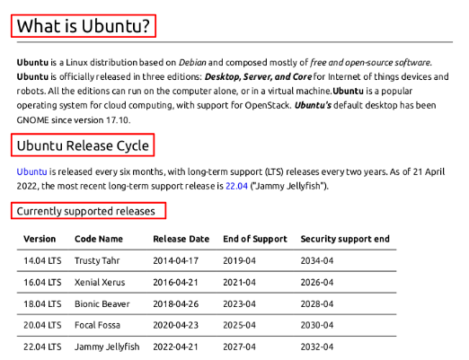
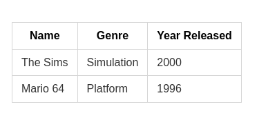

# Final Exam Study Notes

## 1. How to clone a GitHub repository

* In the terminal, we can run : `git clone url-of-repository-here`

<hr>

## 2. How to use the git commands

* There are many git commands. The following are most common git commands:

    | Command                          | Purpose                                                                                   |
    | -------------------------------- | ----------------------------------------------------------------------------------------- |
    | `git clone repository-url`       | This command  clones or download a GitHub repository into our computer.                          |
    | `git pull`                       | This command is useful to synchronize the local repository with latest changes from GitHub |
    | `git add .`                      | Add all changes in the current folder as ready to commit.                                |
    | `git commit -m "commit-message"` | Commit the changes of the tracked files with a commit message                               |
    | `git push`                       | Push the local changes into GitHub.                                                       |

<hr>

## 3. How to write a Markdown file that contains images and proper formatting

Adding images in a markdown files can be achieved by using this syntax
* **Formula:**``

By default, md files does not support formatting images. But some html code can be used to adjust the width and height of images.

Other than this, proper formatting can be provided in a markdown file by providing proper spaces, setting proper headings, and providing data in tables wherever required.

* **Headings:** Start the line with a `#` symbol then space.
* **For example:**
  * `# What is Ubuntu?`
  * `## Ubuntu Release Cycle`
  * `### Currently supported releases`


* **Paragraph:**
  * **Bold Text:** Start and end a word or line with **2*** `**` with **no space** between the * and first or last word.
  * **Italics:** Start and end a word or line with **1*** `*` with **no space** between the * and first or last word.
  * **Strike through:** Start and end a word or line with **2~** `~~` with **no space** between the ~ and first or last word.
* **Links:**
  * **Formula:** `[Text here](URL here)`
* **Tables:**
  * 1. An empty space before and after table.
  * 2. Every row starts and ends with a pipe.
  * 3. The first row is the table headers.
  * 4. USe --- for the second row to divide the headers from the table content
* **For example:**
    1.`|Name|Genre|Year Released|`
    2.`|----|-----|-------------|`
    3.`|The Sims|Simulation|2000|`
    4.`|Mario 64|Platform|1996|`



* **Code formatting:**

<hr>

## 4. How to convert a Markdown file to PDF

To be able to convert a Markdown file to PDF, we must first have installed the relevant VS Code plugin. For example if we have installed "Markdown PDF", we can convert md file into PDF by doing the following:

    a. Right click inside the md file
  
    b. Select Markdown PDF: Export (PDF)

This will generate a pdf file in the same folder as the md file.

<hr>

## 5. How to compress (zip) a directory/folder in Debian

<hr>

## 6. What are Absolute paths and relative paths? (provide examples with commands. For example, creating a file using an absolute path.)

Absolute path is the locaiton of a file starting at the root of a filesystem, while relative path is the location of a file startin from a child directory of the current working directory.
For example, creating a file using an absolute path:

```
# Absolute path 
touch ~/test.md

# Relative path
touch ./test.md
```

Both of the commands above will create the `test.md`. The first one (Absolute path) will create it in the home directory regardless of the current directory. But the second command (relative path) will create the file in the current working directory.

<hr>

## 7. How to work with the manual pages (man command)?

We can use man page to shows or display the manual page for a given command

* **Usage**:
  `man` + `options` + `command`
* **Examples**:
  * To open the man page of echo command
    * `man echo`
  * To open a specific man page
    * `man 5 passwd`
  * To show all available man page
    * `man -f passwd`

---

## 8. How to parse (search) for specific words in the manual page

We can pipe the output of the man page and provide a keyword so that only lines containing the keyword will be displayed as an output.

For example:

* Display only the options of any **command from its man page**
  * `man ls | grep "^[[:space:]]*[[:punct:]]"`

---

## 9. How to redirect output (>, >>, and |)

There are multiple ways to redirect outputs available to be used.

* Using `>` will redirect an output and either create or replace a file that already exists and overwrite whatever is already inside the file.

```
ls -la > allmyfiles.lst
```

* Using  `>>` will redirect an output place it at the end of a file. For exampel:

```
  ls -la >> allmyfiles.lst
```

* Using `|` will redirect the out put of a command so that it can be used as an input for another command. For example:

```
man ls | grep "^[[:space:]]*[[:punct:]]"
```

---

## 10. How to append the output of a command to a file

* **Definition:**
  * Append means to **add more to a file instead of overwriting its content**. We use **">>"** to append.
  * When we use `>` on a file that already exist and contains data, we overwrite whatever is already inside the file. For example:
    * `ls -la > allmyfiles.lst`
  * In this example, if the file allmyfiles.lst had any data prior executing the command, that data will be overwritten by the output of `ls -la`.
  * So, if we want to keep the old data? Then we use `>>`. For example:
    * `ls -la >> allmyfiles.lst`
  * This will add the output of `ls -la` to the end of the file `allmyfiles.lst`.
* **Usage:**
  * `command output + >> + file`
* **Examples:**
  * **Appends** the current directory list to the end of a file (append-example.txt).
    * `ls >> append-example.txt`
  * Appends error messages from list command to the end of a file (append-example.txt).
    * `ls Docu . 2>> append-example.txt`
  * Appends lines 1-6 from the last 7 lines of a file to another file.
    * `tail -7 append-example.txt | head -6 >> files-list.txt`

---

## 11. How and when to redirect the output of a command to another (pipes)

 The pipe allows us to **redirect** the standard output of a command to the standard input of another. We need to redirect the output using piles in cases where we need to do additional action on the output of a commannd like filtering using grep, head, tail, etc.

* **Usage:**
  * `command_1 | command_2 | command_3 | ----- | command_N`
* **Examples:**
  * Use **grep** to look for a string in a **particular man page**
    * `man ls | grep "human-readable"`
  * **Display** only the options of the of **any command from its man page**
    * `man ls | grep "^[[:space:]]*[[:punct:]]"`
  * Display only the **IP addresses** from the output of the ip command
    * `ip addr | grep -Eo '[[:digit:]]{1,3}\.[[:digit:]]{1,3}\.[[:digit:]]{1,3}\.[[:digit:]]{1,3}'`
  * Display only the **2nd line in a file**
    * `head -2 ~/Documents/sample_files/Lst/users.lst | tail -1`
  * **Parse** a file with grep **and replace** a string in the output
    * `grep -i "honda" ~/Documents/sample_files/Csv/cars.csv | sed 's/Honda/tesla/g'`

---

## 12. How to use echo and output redirection to create a new file that contains some text?

We can use echo and output redirection to create a file by using the  > or >> symbols. For example:

```
 echo -e "Hello world" > hello_world.txt 
```

---

## 13. How to use wildcards (For copying and moving multiple files at the same time)

Using wildcards involves using one or more of the 3 wildcards:

* `*` : matches zero to any number of characters
* `?` : matches only 1 character
* `[]` : matches 1 character from as given set

To use this for moving multiple files, follow the following examples:

* Move all the files one directory to another
  * `mv ~/Downloads/Nature/* ~/Pictures/wallpapers/`
* Copy specific files based solely on their file extension
  * `cp ~/Downloads/home/*.pdf ~/Documents/*.txt ~/Projects/school/`
* Move specific files from one directory to another
  * `mv Downloads/Movies/{*.png,*.gif} Downloads/Movies/MCU`

---

## 14. How to use brace expansion (For creating entire directory structures in a single command)

* Start with an open brace
* With no spaces, type your string separating entries by command
* Close the brace
* **Examples:**
  * Create 3 different files with the same name but different file extensions
    * `touch file.{md,txt,rtf}`
  * Create 10 files in a range from 0 to 9
    * `touch file{0..9}.txt`
  * Remove specific files that start with a given keyword  
    * `rm image_*{01..08}*_camera.{png,jpg}`
  * Create an entire directory tree in a single command(1 level deep)
    * `mkdir -pv project_venus/{code,source,dataset}/new`
  * Create an entire directory tree in a single command(2 level deep)
    * `mkdir -pv project_jupiter/site/{old,new}/{code/{scripts,markup},assets/{imgs,mp3,mp4}}`

---

## 15. How to create a simple “hello world” shell script  

* **Definition:**  
  * A **shell script** is a text file containing commands for the shell to execute.  
  * A simple “Hello World” script demonstrates script creation and execution basics.  

* **Steps / Usage:**  
  1. Create a new file with `.sh` extension (e.g., `hello.sh`).  
  2. Add the **shebang line** at the top: `#!/bin/bash`.  
  3. Write the command: `echo "Hello World"`.  
  4. Save the file and make it executable: `chmod +x hello.sh`.  
  5. Run the script: `./hello.sh`.  

* **Example Script:**  

  ```bash
    #!/bin/bash
    # Simple hello world script
    echo "Hello World"
  ```  

---

## 16. How to use variables in a shell script  

* **Definition:**  
  * Variables store values (strings, numbers, or command outputs) for reuse in a script.  
  * They make scripts flexible and dynamic.  

* **Usage / Formula:**  
  * Assign: `variable_name=value`  
  * Access: `$variable_name`  
  * Input: `read variable_name`  
  * Command output: `variable=$(command)`  

* **Examples:**  
  * Assign and print a variable  

    ```bash
    name="Aayushma"
    echo "Hello, $name"
    ```  

  * Store command output in a variable  

    ```bash
    current_date=$(date)
    echo "Today is: $current_date"
    ```  

  * Arithmetic with variables  

    ```bash
    num1=10
    num2=5
    sum=$((num1 + num2))
    echo "Sum is: $sum"
    ```  

  * Use environment variables  

    ```bash
    echo "Home directory: $HOME"
    echo "Current shell: $SHELL"
    ```  

---

## 17. For each of the following commands, include a definition, syntax/formula/usage/, and 2 - 5 well-documented examples

### a. awk

* **Definition:**

  * Awk is a scripting language used for **processing and displaying text files**. Awk can work with a text file or from standard output.
  * There are several implementations of Awk: nawk, mawk, gwak, and busybox.
  * Awk performs operations line by line.
  * **Usage:**
    * `awk + options + {awk command} + file + file to save (optional)`
* **Awk Variables:**

  | Variable     |    Description  |
  |--------------|----------------------------------|
  | $0           | Whole line                                        |
  | \$1,\$2...$NF| First, second... last field                       |
  | NR           | Total Number of Records                           |
  | NF           | N number of Fields                                |
  | OFS          | Output Field Separator (default " ")              |
  | FS           | Input Field Separator (default " ")               |
  | ORS          | Output Record Separator (default "\n")            |
  | RS           | Input Record Separator (default "\n")             |
  | FILENAME     | Name of the file                                  |
  | ARGC         | Number of arguments                               |
  | ARGV         | Array of arguments                                |
  | FNR          | File Number of Records                            |
  | OFMT         | Format for numbers (default "%.6g")               |
  | RSTART       | Location in the string                            |
  | RLENGTH      | Length of match                                   |
  | SUBSEP       | Multi-dimensional array separator (default "\034")|
  | ARGIND       | Argument Index                                    |
  | ENVIRON      | Environment variables                             |
  | IGNORECASE   | Ignore case                                       |
  | CONVFMT      | Conversion format                                 |
  | ERRNO        | System errors                                     |
  | FIELDWIDTHS  | Fixed width fields                                |

* **Examples:**
  * **Print** the **first column** of every line of a file.
    * `awk '{print $1}' ~/Documents/sample_files/Csv/cars.csv`
  * Print **first field** of /etc/passwd file
    * `awk -F: '{print $1}' /etc/passwd`
  * Print the **last field** of the /etc/passwd file
    * `awk -F: '{print $NF}' /etc/passwd`
  * Print the **first and last field** of the /etc/passwd
    * `awk -F: '{print $1," = ",$NF}' /etc/passwd`
  * Print the **first and 3 field** with line numbers
    * `awk -F: '{print NR,$1,$3}' /etc/passwd`
  * Print the **first and 4th field** with a **different field separator**
    * `awk -F: '{OFS="="}{print $1,$4}' /etc/passwd`
  * **Start printing** a file **from a given line** (exclude the first 2 lines)
    * `awk 'NR > 3 { print }' /etc/passwd`
  * **Convert** the first field **to upper/lower case**
    * `awk -F: '{print toupper($1)}' /etc/passwd`
  * Prints the **length of a line**(record)
    * `awk '{print length($0)}' /etc/passwd`
  * Print **specific fields based on a command output**. For example, the size and file name
    * `ls -lhF Documents/ | awk 'BEGIN { printf "%s\t%s\n", "Size","Name"} {print $5,"\t",$9}'`
      * BEGIN block is executed once at the start
  * Print **specific fields with a head** of the /etc/passwd file
    * `awk -F: 'BEGIN { printf "%s\t\t%s\n","User", "Shell" } {print $1,"\t",$7}' /etc/passwd`

    ---

  ### b. cat

  * **Definition:**
    * The **cat command** is used for displaying the content of a file.
    * **Cat** is short for **concatenate** which is the command's intended use.
  * **Usage:**
    * `cat + option + file(s) to display`
  * **Examples:**
    * Display the content of a file located in ~/Documents/sample_files/
      * `cat ~/Documents/sample_files/Code/helloWorld.py`
    * Display the content of a file **with line numbers**
      * `cat -n ~/Documents/sample_files/Code/helloWorld.py`
    * Display the content of a file including **non printing characters and line endings**
      * `cat -A ~/Documents/sample_files/Code/helloWorld.py`
    ---

  ### c. cp

  * **Usage:**
    * **cp** is used to copy files/directories from a source to a destination
    * Must use the `-r` option to copy directories

  * **Formula:**
    * `cp + option + file/ directories to copy + destination`
    * `cp -r + directory to copy + destination`

    **Common Options:**
    * `-r` or `-R`: Recursively copy directories and their contents.
    * `-i`: Prompt before overwriting an existing file.
    * `-u`: Copy only when the source file is newer than the destination file or when the destination file is missing.
    * `-v`: Verbose mode, showing the files as they are copied.
    * `-a`: Copy files and directories, preserving attributes like timestamps and permissions.

  * **Examples:**
    * To copy a file
      * `cp Downloads/wallpapers.zip Pictures/`
    * To copy a directory with **absolute path**
      * `cp -r ~/Downloads/wallpapers ~/Pictures/`
    * To copy the content of directory to another directory
      * `cp Downloads/wallpapers/* ~/Pictures/`
    * To copy multiple files in a single command
      * `sudo cp -r script.sh program.py home.html assets/ /var/www/html/`
    * To copy a directory with verbose output
      * `cp -rv ~/projectOrion/ ~/Documents/`
    ---

  ### d. cut

  * **Definition:**
    * The **cut command** is used to extract a specific section of each line of a file and display it to the screen.
  * **Usage:**
    * `cut + option + file(s)`

  * **Examples:**
    * **Display** a list of all the users in your system
      * `cut -d ':' -f1 /etc/passwd`
    * **Display** a list of all the users in your system with their **login shell**
      * `cut -d ':' -f1,7 /etc/passwd`
    * **Cut** a range of **bytes per line**
      * `cut -b 1-5 practice.txt`
    * Cut a file **using a delimiter** but changing the delimiter in the output.
      * `cut -d ':' -f1,7 --output-delimiter=' ⇒ ' /etc/passwd`
    * Cut a file **excluding a given field**
      * `cut -d ':' --complement -s -f6 /etc/passwd`
    * Cut the **permissions from the output** of ls
      * `ls -l | cut -d ' ' --complement -s -f1`
    ---

  ### e. grep

  * **Definition:**
  * Grep is used to **search text in given file**. Grep works or search in a line by line basis.
* **Usage:**
  * `grep + option + search criteria + file(s)`
* **Common Options:**
  * `-i`: Enables case insensitivity (matches regardless of case).
  * `-n`: Displays line number for every line matched.
  * `-E`: Treats the pattern as an extended regular expression.
  * `-G`: Treats the pattern as a basic regular expression.
  * `-v`: Inverts the search (finds lines that do not match the pattern).
  * `-o`: Only displays the matched string.
  * `-c`: Displays the total number of times a pattern is matched.
  * `-w`: Matches only the whole word (exact pattern).
  * `-r` or `-R`: Searches recursively through directories.
* **Examples:**
  * **Search** any line that contains the word **"dracula" in the given file**.
    * `grep 'dracula' ~/Documents/sample_files/Txt/dracula.txt`
  * Search any line that contains the word "dracula" **regardless of the case**.
    * `grep -i 'dracula' ~/Documents/sample_files/Txt/dracula.txt`
  * Display how many **lines** contain the **matched string**.
    * `grep -c 'Dracula' ~/Documents/sample_files/Txt/dracula.txt`
  * Search any line that contains the word "dracula" **regardless of case and with number line**
    * `grep -in 'dracula' ~/Documents/sample_files/Txt/dracula.txt`
  * Search for all the lines that **do not contain the word 'war'**
    * `grep -v 'war' ~/Documents/sample_files/Txt/war-and-peace.txt`
  * Search and display **only the matched string** (pattern)
    * `grep -o 'pride' ~/Documents/sample_files/Txt/war-and-peace.txt`
  * Display a **list of users** with the **/bin/bash login shell**
    * `grep -i "/bin/bash" /etc/passwd`
  * Display your **user's information** as stored in the **/etc/passwd**
    * `grep -i $USER /etc/passwd`
  * Search for a **given strings** inside files in a given directory
    * `grep -iR 'conf' /etc/`
  * Search and display the **total number of times a given word appears** in a file
    * `grep -wc '/bin/bash' /etc/passwd`
  * The **^ (caret) symbol** matches the empty string at the beginning of a line. Search for all the **lines that start with a given word**
    * `grep -ni '^dracula' ~/Documents/sample_files/Txt/dracula.txt`
  * Search for all the **lines** that ends with the **string "nologin"**
    * `grep -n 'nologin$' /etc/passwd`
  * Search for all the **lines** that **start with a capital letter**
    * `grep -n '^[A-Z]' ~/Documents/sample_files/Txt/dracula.txt`
  * Search for **more than one word per line**
    * `grep -Ewn 'horror|love|scare' ~/Documents/sample_files/Txt/dracula.txt`
  * Match only lines containing **IPv4 addresses**
    * `grep -E '[[:digit:]]{1,3}\.[[:digit:]]{1,3}\.[[:digit:]]{1,3}\.[[:digit:]]{1,3}' ~/Documents/sample_files/Txt/practice.txt`
  * Search all lines that contain a **character repeated 3 times**
    * `grep -E "A{3}" file.txt`
  * Search all lines that contain a **phone number** of the **format 973-111-2222**
    * `grep "[[:digit:]]\{3\}[-][[:digit:]]\{3\}[-][[:digit:]]\{4\}" ~/Documents/sample_files/Csv/contacts.csv`
  * Display only the options of any **command from its man page**
    * `man ls | grep "^[[:space:]]*[[:punct:]]"`
  * Search for all the **lines** that contain a **single word "linux"** in all the **files in the system**
    * `grep -niR '^linux$' /`
  * The **period (.) symbol** is a meta-character that **matches any single character**. It searches for all lines that contain a word starting with the letter "d" followed by any 4 characters
    * `grep -n '^d....' ~/Documents/sample_files/Txt/dracula.txt`
  * **Bracket expressions** allows match a **group of characters** by enclosing them in bracket []. It matches all lines that contain the words **"list", "last", or "lost"**
    * `grep -n 'l[aio]st' ~/Documents/sample_files/Txt/dracula.txt`
    ---

  ### f. head

  * **Definition:**
    * The **head command** displays the top N number of lines of a given file.
    * By default, it prints the **first 10 lines**. If more than one file name is provided then data from each is preceded by its file name.
  * **Usage:**
    * `head + option + file(s)`
  * **Examples:**
    * Display the **first 10 lines** of a file
      * `head ~/Documents/sample_files/Txt/dracula.txt`
    * Display the **first 5 lines** of **a file**
      * `head -5 ~/Documents/sample_files/Txt/dracula.txt`
    * Display the **first 5 lines** of **multiple files**
      * `head -n 5 ~/Documents/sample_files/Txt/{dracula,war-and-peace}.txt`
    * Display the **first line of multiple files** using wildcards
      * `head -n 1 Csv/*.csv Code/*.py`
    * Display **a given number of lines** of the output of a given command
      * `ls -l ~/cis106/ |head -n 2`
    * Display the **name of the file** in the output
      * `head -v -n 7 Json/joke.json`
    * Display a **given number of bytes** instead of lines
      * `head -c 50 Txt/dracula.txt`
    ---

  ### g. ls

  * **Usage:**
    * `ls` is used for listing files and directories.
    * By default it will list the current directory when no directory is specified.
    * Listing means to see what is inside a directory.
  * **Formula:**
    * `ls + option + directory(ies) to list`
  * **Examples:**
    * See all the options of the ls command (extracted from the man page):
      * `ls --help`
    * List the current directory:
      * `ls`
    * List all the files including hidden files in current directory:
      * `ls -A`
    * Long list a directory
      * `ls -lA ~/Pictures`
    * List a directory recursively
      * `ls -R Documents/`
    * Long list a directory only
      * `ls -ld Documents/`
    * List a directory sorted by last modified
      * `ls -t Documents/`
    * List a directory sorted by file size
      * `ls -S Documents/`
    * Long list a directory excluding group and owner information, with human readable file size and sorted in reverse order.
      * `ls -lhgGr Documents/`
  ---

  ### h. man

  * **Definition**:

      Shows or displays the manual page for a given command

  * **Usage**:

    `man` + `options` + `command`

  * **Examples**:
    * To open the man page of echo command
      * `man echo`
    * To open a specific man page
      * `man 5 passwd`
    * To show all available man page
      * `man -f passwd`
  ---

  ### i. mkdir

  * **Usage:**
  * **mkdir** is used for creating a single directory or multiple directories (folders) **by separating each directory name with a space**.

  * **Formula:**
    * `mkdir + option + the name of the directory`

    **Where directory name can be:**
    * Just the name of the directory if we want to create them in the **current working directory**
    * **Absolute** or **relative path** if we want to create the directory in a different location

  * **Examples:**
    * Create a directory in the present working directory called wallpapers
      * `mkdir wallpapers`
    * Create a directory in a different directory using **relative path**
      * `mkdir wallpapers/ocean`
    * Create a directory in a different directory using **absolute path**
      * `mkdir ~/wallpapers/forest`
    * Create a directory with a space in the name
      * `mkdir wallpapers/new\ cars`
      * `mkdir wallpapers/'cities usa'`
    * Create a directory with a single quote in the name
      * `mkdir wallpapers/"major's mask"`
    * Create multiple directories
      * `mkdir wallpapers/cars wallpapers/cities wallpapers/forest`
    * Create a directory with a parent directory at the same time.
      * `mkdir -p wallpapers_others/movies`
    * Create a directory and display a message confirming the directory creation (**verbose output**)
      * `mkdir -pv wallpapers_others/movies`

    ---
  
  ### j. mv

  * **Usage:**
    * **mv** is used to move and rename files and directories.
    * **mv** cannot rename more than 1 file at the time
    * **mv** can move and rename a file at the same time
    * **mv** will set the last argument as the destination or file new name

  * **Formula:**
    * **Move:** `mv + option + file,directories to move + destination`
    * **Rename :** `mv + option + file/directory to rename + new name`

    **Common options of the mv command:**
    * `-i`: Prompt before overwriting an existing file.
    * `-u`: Move only when the source file is newer than the destination file or when the destination file is missing.
    * `-v`: Verbose mode, showing the files as they are moved or renamed.

  * **Examples:**
    * To **move** a file from a directory to another using **relative path**
      * `mv Downloads/homework.pdf Documents/`
    * To **move** a directory from one directory to another using **absolute path**
      * `sudo mv ~/Downloads/theme /usr/share/themes`
    * To **move** a file from one directory to another combining **absolute path** and **relative path**
      * `mv Downloads/english_homework.docx /media/student/flashdrive/`
    * To **move** multiple directories/files to a different directory
      * `mv games/ wallpapers/ rockmusic/ /media/student/flashdrdive/`

    * To **rename** a file
      * `mv homework.docx cis106homework.docx`
    * To **rename** a file using **absolute path**
      * `mv ~/Downloads/homework.docx ~/Downloads/cis106homework.docx`

    * To **move and rename** a file in the same command
      * `mv Downloads/cis106homework.docx Documents/new_cis106homework.docx`
    ---

  ### k. tac

  * **Definition:**
  * The **tac command** is used for displaying the content of a file in **reverse order**.
  * Just like cat, tac concatenates files and displays the output of the concatenation.
  * **Usage:**
    * `tac + option + file(s) to display`
  * **Examples:**
    * Display the content of **a file** located in ~/Documents/sample_files/ in reverse order
      * `tac ~/Documents/sample_files/Code/helloWorld.py`
    * Display the content of **multiple files** in reverse order
      * `tac ~/Documents/sample_files/Code/helloWorld.py ~/Documents/sample_files/Code/helloWorld.sh`

    ---

  ### l. tail

  * **Definition:**
    * The **tail command** displays the last N number of lines of a given file.
    * By default, it prints the **last 10 lines**. If more than one file name is provided then data from each fil e is preceded by its file name.
  * **Usage:**
    * `tail + option + file(s)`
  * **Examples:**
    * Display the **last 10 lines** of a file
      * `tail ~/Documents/sample_files/Txt/dracula.txt`
    * Display the **last 5 lines** of **a file**
      * `tail -5 ~/Documents/sample_files/Txt/dracula.txt`
    * Display the **last 5 lines** of **multiple files**
      * `tail -n 5 Txt/{dracula,war-and-peace}.txt`
    * Display the **last line of multiple files** using wildcards
      * `tail -n 1 Csv/*.csv Code/*.py`
    * Display a **given number of lines** of the output of a given command
      * `ls -l ~/cis106/ |tail -n 2`
    * Display the **name of the file** in the output
      * `tail -v -n 7 Json/joke.json`
    * Display a **given number of bytes** instead of lines
      * `tail -c 50 Txt/dracula.txt`
      ---

  ### m. touch

  * **Usage:**
    * **touch** is used for creating files an empty file or to update the timestamp of an existing file..

  * **Formula:**
    * `touch + name of the file`

    **Where directory name can be:**
    * Just the name of the directory if we want to create them in the **current working directory**
    * **Absolute** or **relative path** if we want to create the directory in a different location

  * **Examples:**
    * Create a file called list
      * `touch list`
    * Create multiple files
      * `touch list_of_cars.txt script.py names.csv`
    * Create a file using **absolute path**
      * `touch ~/Downloads/games.txt`
    * Create a file using **relative path** (assuming you pwd your home directory)
      * `touch Downloads/games2.txt`
    * Create a file with a space in its name
      * `touch "list of foods.txt"`

---

### n. tr  

* **Definition:**  
  * The **tr command** (short for *translate*) is used to **translate, squeeze, or delete characters** from standard input and write the result to standard output.  
  * It works only on **stdin → stdout**, meaning it doesn’t take files directly as arguments (you pipe or redirect input into it).  

* **Usage:**  
  * `tr [options] set1 [set2]`  

* **Examples:**  
  * Convert all lowercase letters to uppercase  
    * `cat file.txt | tr 'a-z' 'A-Z'`  
  * Delete all digits from a file  
    * `cat file.txt | tr -d '0-9'`  
  * Replace spaces with newlines  
    * `echo "one two three" | tr ' ' '\n'`  
  * Squeeze multiple spaces into a single space  
    * `echo "hello     world" | tr -s ' '`  
  * Remove all newline characters (make text continuous)  
    * `cat file.txt | tr -d '\n'`  

  ---

### o. tree  

* **Definition:**  
  * The **tree command** displays the **directory structure of a path or the current directory** in a **tree-like format**.  
  * It recursively lists subdirectories and files in a hierarchical view.  

* **Usage:**  
  * `tree [options] [directory]`  

* **Examples:**  
  * Display the tree structure of the current directory  
    * `tree`  
  * Display the tree structure of a specific directory  
    * `tree ~/Documents/sample_files`  
  * Limit the depth of the tree to 2 levels  
    * `tree -L 2`  
  * Show hidden files in the tree  
    * `tree -a`  
  * Display the size of each file in the tree  
    * `tree -s`  
  * Print the tree with full path prefix for each file  
    * `tree -f`  
  * Export the tree output into a file  
    * `tree ~/Projects > project_structure.txt`  

  ---
